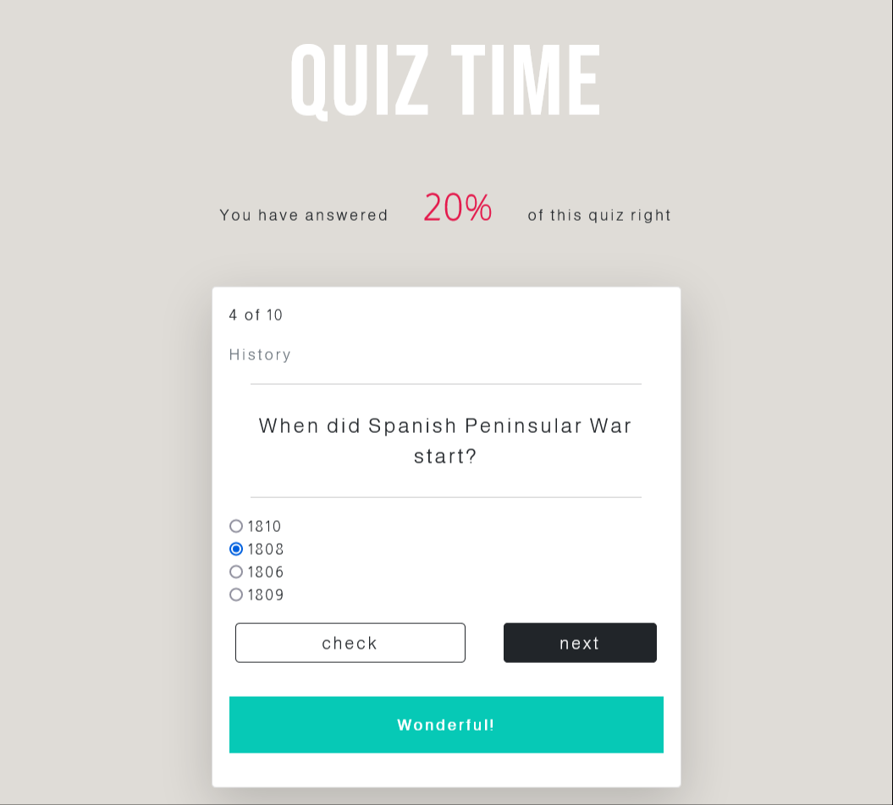

# Quiz_App

  

A quiz application written in HTML5, JavaScript ES6 and ES7, Sass and the API from [the Open Trivia Database](https://opentdb.com).

The user has 10 random questions of different category and diffuculty with 4 possible answers each. 
After chosing the answer and clicking on 'check', the user receives a message marked by the color green or red, if it's right or wrong. 
The score will be updated automatically.
When quiz is finished, the page will be reloaded after 5 seconds.

The following tools and frameworks are also used in the project:
* Bootstrap v.5.0.0
* font-awesome library
* google-fonts.
